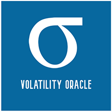

<p align="center">

</p>

# Yield Volatility Oracle

This repository contains the [external adapter](https://docs.chain.link/docs/developers/) application code for Yield Volatility Oracle. 
Reference to this project [here](https://www.notion.so/Yield-Volatility-Oracle-derivatives-base-on-volatility-1e2bbc14669a464b84f8a85706a0489c)

This project started as a submission to the [2021 Hack Money Hackathon](https://showcase.ethglobal.co/hackmoney2021/yield-volatility-oracle)

This external adapter can provide a volatility rating for short-term (10 days), mid-term (50 days), and long-term (100 days) of various yield farming pools.
Currently the external adapter supports Uniswap V2 but we plan to expand upon this in the future.

Our metrics for the uniswap v2 integration work by calculating the daily APY for the supplied days in the day range and then calculating the standard deviation of the daily apy vector. See a comprehensive historical analysis [here](https://vintrocode.github.io/historical-volatility/historical-volatility/notebooks/historical-volatility.html) for context around yield volatility.

## Job Usage
The Uniswap v2 job takes two parameters the pool (address of the pool in question) and the day range (10, 50, 100).
```
    Chainlink.Request memory req = buildChainlinkRequest(stringToBytes32(_jobId), this, this.fulfillPoolApyStd.selector);
    req.add("pool", _pool);
    req.add("range", _range);
    sendChainlinkRequestTo(_oracle, req, ORACLE_PAYMENT);
```
For testing this job against a deployment you can use our [example consumer contract](https://gist.github.com/camharris/53546695bbfca3c7a86a0c56413f32c9)

## Addresses
```
Kovan: 0x20cD09897ddc1682f14eb6E55C46223f615426d7 
```

## Deployment 
In order to deploy this external adapter on a Chainlink node a bridge must be created within the node pointing to the URL of the running external adapter.
<p align="center">

</p>

Once the bridge is created, a job can be created with [this job spec](./chainlink_job_spec.json), be sure to update the address to your own oracle contract address

## Development and running
The development environment is managed by docker-compose. The application code is mounted in a volume using docker compose meaning while running the application you're able edit the code while the application is running thanks to the use of uvicorn 
```
echo 'API_KEY=${DESIRED API KEY}' > .env.local
docker-compose build  
~~
docker-compose up 
```
The external-adapter/api can then be accessed at http://localhost:8000/docs
Currently there is an empty .env.local file, in the future this file may contain secrets for The Graph sub graphs 

### Python dependencies 
Python dependencies are managed by [poetry](https://python-poetry.org/). In order to add a new python dependency or package run the following:
```
poetry add $PACKAGE
```
This will require that you have poetry installed locally. In order to get your newly added dependency into the container you will need to run a docker-compose build again, luckily this should take less than 2 minutes. 
